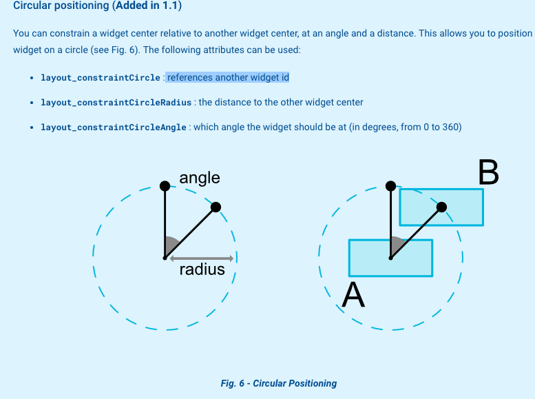

### ConstraintLayout(约束布局)

#### 简介

约束布局，简明来说就是根据一个对象来进行本对象的相对约束。

#### 使用介绍

* #### Relative positioning

```xml
						 <Button
            android:id="@+id/btn_a"
            android:layout_width="wrap_content"
            android:layout_height="wrap_content"
            app:layout_constraintLeft_toLeftOf="parent"
            app:layout_constraintRight_toRightOf="parent"
            app:layout_constraintTop_toTopOf="parent"/>
```

以上都是A控件相对于B空间，A控件的左边对应B控件的左边，右边对应右边，顶部对应顶部。A控件即为Button，B控件在这为父控件。约束布局中，控件一定要能明确位置。

```xml
  <Button
            android:id="@+id/btn_b"
            android:layout_width="wrap_content"
            android:layout_height="wrap_content"
            app:layout_constraintLeft_toLeftOf="parent"
            app:layout_constraintRight_toRightOf="parent"
            app:layout_constraintTop_toTopOf="parent"
            app:layout_constraintCircle="@id/btn_a"
            app:layout_constraintCircleRadius="70dp"
            app:layout_constraintCircleAngle="150"/>
```

后三个属性为引用另一个部件方式，圆的半径，圆的角度。这里给一张官方的参考图。



* ##### Bias:

```xml
app:layout_constraintHorizontal_bias="0.4"
app:layout_constraintVertical_bias="0.4"
```


控件水平从左到右，从上到下的间隔。(单位为百分比)

#### 使用相应引导线进行约束

```xml
   <android.support.constraint.Guideline
        android:id="@+id/found_content_guideline_25"
        android:layout_width="wrap_content"
        android:layout_height="wrap_content"
        android:orientation="vertical"
        app:layout_constraintGuide_percent="0.25" />

```

引导线方向为垂直，占比为25%。（从左开始）

如果方向为水平，则从顶部开始。